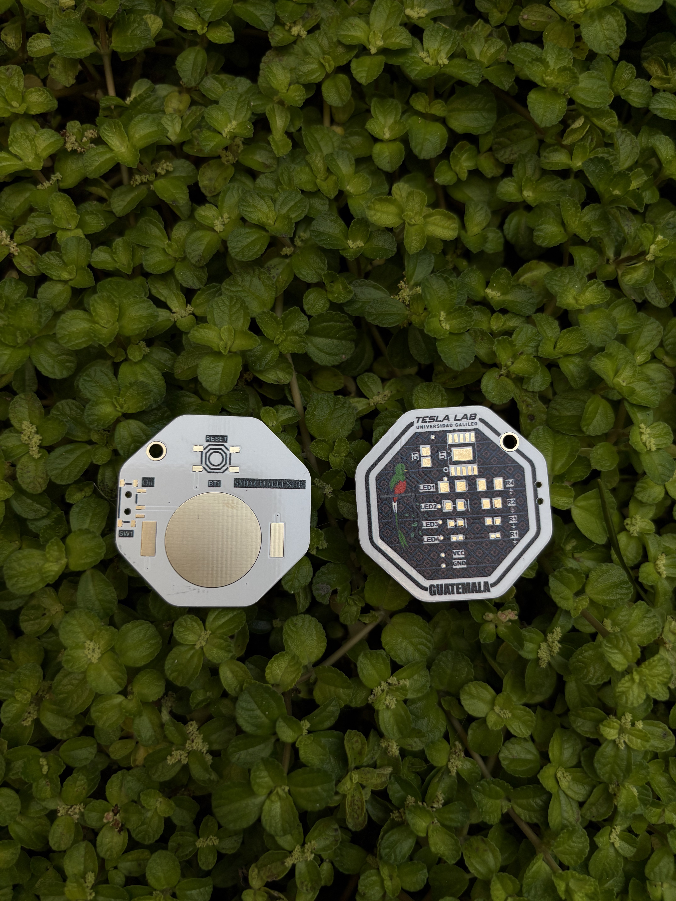
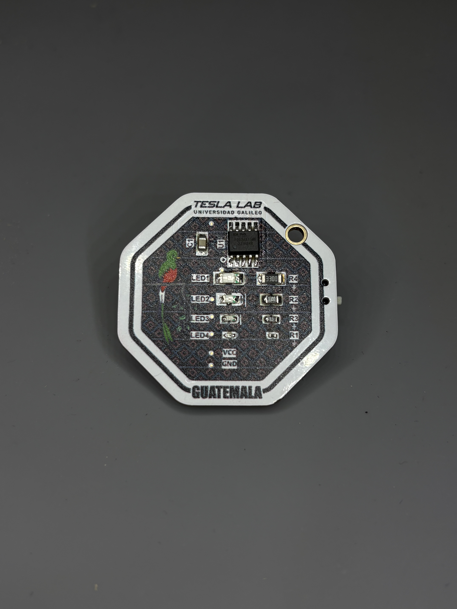

# smdChallenge
Reto de sodardura SMD diseñado para ***FIT*** ( Foro de innovación Tecnológica), es un ***reto completamente gratuito***. 

| Top Layer | Bottom Layer |
|----------|------|
| 

 | 

 |

## Créditos / Agradecimientos

Gracias a [aspro648](https://github.com/aspro648) por la inspiración original y su trabajo en diseños previos.

Gracias a [Electronic Cats](https://github.com/ElectronicCats/SolderingChallenge?tab=readme-ov-file) por las mejoras, inspiración y motivación para el uso de Hardware y Software Open Source.

Gracias a Universidad Galileo y Tesla Lab por su apoyo.

A la comunidad de Makers y Talent Land 2019 por incentivar esta idea.